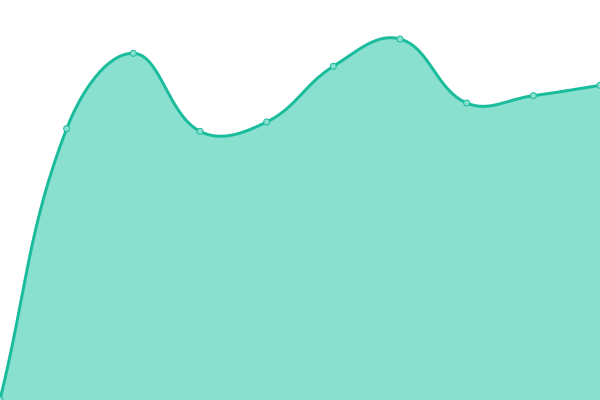

# [📈 Live Status](https://demo.upptime.js.org): <!--live status--> **🟧 Partial outage**

This repository contains the open-source uptime monitor and status page for [Andre Halvorsen](https://demo.upptime.js.org), powered by [Upptime](https://github.com/upptime/upptime).

With [Upptime](https://upptime.js.org), you can get your own unlimited and free uptime monitor and status page, powered entirely by a GitHub repository. We use [Issues](https://github.com/Adathor/upptime/issues) as incident reports, [Actions](https://github.com/Adathor/upptime/actions) as uptime monitors, and [Pages](https://demo.upptime.js.org) for the status page.

<!--start: status pages-->
<!-- This summary is generated by Upptime (https://github.com/upptime/upptime) -->
<!-- Do not edit this manually, your changes will be overwritten -->
<!-- prettier-ignore -->
| URL | Status | History | Response Time | Uptime |
| --- | ------ | ------- | ------------- | ------ |
|  [Google](https://www.google.com) | 🟩 Up | [google.yml](https://github.com/apinter/furry-octo-engine/commits/HEAD/history/google.yml) | 

 122ms
     
 | 

<a href="https://apinter.github.io/furry-octo-engine/history/google">100.00%</a>
    

|  LGR API | 🟥 Down | [lgr-api.yml](https://github.com/apinter/furry-octo-engine/commits/HEAD/history/lgr-api.yml) | 

 1008ms
     
 | 

<a href="https://apinter.github.io/furry-octo-engine/history/lgr-api">1.85%</a>
    

|  LGR platform | 🟥 Down | [lgr-platform.yml](https://github.com/apinter/furry-octo-engine/commits/HEAD/history/lgr-platform.yml) | 

 0ms
     
 | 

<a href="https://apinter.github.io/furry-octo-engine/history/lgr-platform">0.00%</a>
    

|  ST1 API | 🟩 Up | [st-1-api.yml](https://github.com/apinter/furry-octo-engine/commits/HEAD/history/st-1-api.yml) | 

 283ms
     
 | 

<a href="https://apinter.github.io/furry-octo-engine/history/st-1-api">100.00%</a>
    

|  ST2 API | 🟩 Up | [st-2-api.yml](https://github.com/apinter/furry-octo-engine/commits/HEAD/history/st-2-api.yml) | 

 292ms
     
 | 

<a href="https://apinter.github.io/furry-octo-engine/history/st-2-api">100.00%</a>
    

|  ST3 API | 🟩 Up | [st-3-api.yml](https://github.com/apinter/furry-octo-engine/commits/HEAD/history/st-3-api.yml) | 

 821ms
     
 | 

<a href="https://apinter.github.io/furry-octo-engine/history/st-3-api">100.00%</a>
    

<!--end: status pages-->

[**Visit our status website →**](https://demo.upptime.js.org)

## 📄 License

- Powered by: [Upptime](https://github.com/upptime/upptime)
- Code: [MIT](./LICENSE) © [Andre Halvorsen](https://demo.upptime.js.org)
- Data in the `./history` directory: [Open Database License](https://opendatacommons.org/licenses/odbl/1-0/)
